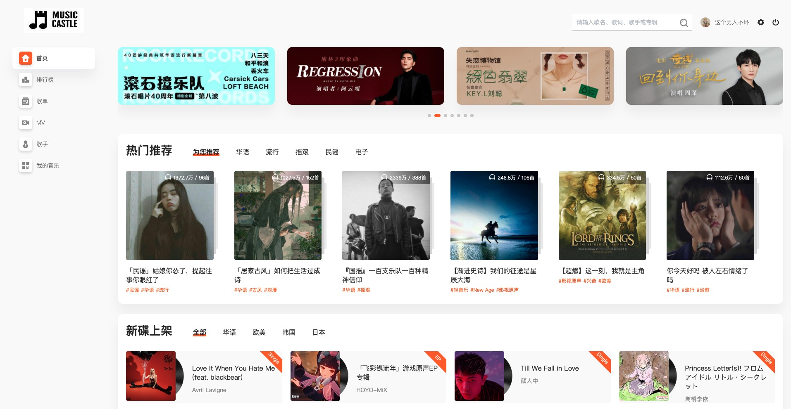

# vue3 网易云音乐

#### 介绍
唔，vue3稍微进阶版，尽量高级一点，代码也尽量规范一点儿，稍微锻炼一下自己。
UI也准备重新开发。有一些好玩的东西在构思中，亟待实现效果。 哈哈  期待能够完成！

[基于网易云音乐API实现PC端音乐网站](https://gitee.com/trtst/vue_pc_music)

[vue3.x重构升级原vue2.x的网易云音乐PC端项目](https://gitee.com/trtst/vue3.x_music)

#### 视频展示

1、[播放器](https://www.bilibili.com/video/BV173411a7MR)

#### 效果图展示

#### 页面功能完成说明

✅  首页 

✅  登录/退出登录

✅  排行榜

✅  歌单列表页

✅  歌单详情页

✅  MV列表页

✅  MV详情页

✅  歌手列表页

✅  专辑详情页

✅  歌曲播放

✅  播放条（有些细节还需要修改优化）

⬜️  评论

⬜️  歌手详情页

⬜️  搜索页面

⬜️  歌曲收藏

⬜️  个人主页

......
